# 🚀 FinSentiment Pro - AI-Powered Stock Market Sentiment Analysis# FinSentiment Pro - AI-Powered Financial Sentiment Analysis


<div align="center">A premium, production-ready Financial Sentiment Analysis web application with real-time multi-dimensional sentiment tracking for stock market intelligence.


## 🚀 Features


- **Multi-Model AI**: FinBERT sentiment analysis + emotion detection

- **Voice Input**: Speak stock tickers using Web Speech API

- **Real-Time Data**: Live news from News API and stock prices from Yahoo Finance

- **Interactive Dashboards**: 

**Real-time AI-powered sentiment analysis platform for Indian stocks using FinBERT NLP and advanced visualization**  - Overall Sentiment Gauge

  - Timeline Charts (Sentiment + Price correlation)

[🌐 Live Demo](#) | [📖 Documentation](#features) | [🐛 Report Bug](https://github.com/HackWGaveesh/FinSentiment-Pro/issues) | [✨ Request Feature](https://github.com/HackWGaveesh/FinSentiment-Pro/issues)  - Multi-dimensional Radar Charts

  - Source Comparison

</div>  - Calendar Heatmap

  - Correlation Scatter Plots

---  - AI-Generated Insights

- **Dark/Light Theme**: Smooth theme transitions with localStorage persistence

## 📋 Table of Contents- **Responsive Design**: Works perfectly on mobile, tablet, and desktop

- **Accessibility**: WCAG 2.1 AA compliant

- [Overview](#-overview)- **Performance Optimized**: Lazy loading, code splitting, memoization

- [Features](#-features)

- [Tech Stack](#-tech-stack)## 📋 Prerequisites

- [Installation](#-installation)

- [Configuration](#-configuration)- **Node.js** (v18 or higher)

- [Usage](#-usage)- **Python** (v3.8 or higher)

- [API Endpoints](#-api-endpoints)- **pip** (Python package manager)

- [Project Structure](#-project-structure)

- [Contributing](#-contributing)## 🛠️ Installation

- [License](#-license)

### 1. Install Frontend Dependencies

---

```powershell

## 🌟 Overviewnpm install

```

<div align="center">


# 📊 FinSentiment Pro

### *AI-Powered Financial Sentiment Analysis for Indian Stock Markets*

Real-time sentiment tracking • FinBERT NLP • Beautiful visualizations • Production-ready

[](LICENSE)
[](https://reactjs.org/)
[](https://www.typescriptlang.org/)
[](https://flask.palletsprojects.com/)
[](https://www.python.org/)
[](http://makeapullrequest.com)

[🚀 Quick Deploy](./QUICKDEPLOY.md) • [📖 Full Guide](./DEPLOYMENT.md) • [🐛 Report Bug](https://github.com/HackWGaveesh/FinSentiment-Pro/issues) • [✨ Request Feature](https://github.com/HackWGaveesh/FinSentiment-Pro/issues)

</div>

---

## 🌟 Overview

**FinSentiment Pro** is an enterprise-grade sentiment analysis platform that combines cutting-edge AI with real-time market data to deliver actionable insights for Indian stocks (NSE). Built with modern web technologies and powered by FinBERT NLP, it transforms raw financial news into clear sentiment signals.

### ✨ Why FinSentiment Pro?

- 🎯 **Accurate**: FinBERT model fine-tuned specifically for financial sentiment
- ⚡ **Fast**: Real-time trending stocks with sub-second analysis
- 🎨 **Beautiful**: Modern glassmorphism UI with dark mode support
- 🛡️ **Resilient**: Smart API rotation and automatic fallback mechanisms
- 📱 **Responsive**: Perfect experience across desktop, tablet, and mobile
- 🔧 **Production-Ready**: Comprehensive error handling and caching

---

## 🎯 Features

<table>
<tr>
<td width="50%">

### 🤖 AI-Powered Analysis
- **FinBERT Sentiment Scoring** (-100 to +100)
- **Confidence Metrics** for each prediction
- **Multi-dimensional Analysis** (6 key metrics)
- **Emotion Detection** (joy, fear, anger, surprise)
- **Source-Level Breakdown** with article counts

</td>
<td width="50%">

### 📊 Rich Visualizations
- **Overall Sentiment Gauge** (animated)
- **Timeline Charts** (sentiment + price correlation)
- **Radar Charts** (multi-dimensional view)
- **Calendar Heatmaps** (historical trends)
- **Scatter Plots** (correlation analysis)
- **Source Comparison** (news provider breakdown)

</td>
</tr>
<tr>
<td width="50%">

### 🔥 Real-Time Market Data
- **Live Trending Stocks** (top gainers/losers)
- **NSE Integration** (RELIANCE.NS, TCS.NS, etc.)
- **Price Updates** via Yahoo Finance
- **Smart API Rotation** (3-key pool)
- **Automatic Fallbacks** for resilience

</td>
<td width="50%">

### 🎨 Premium User Experience
- **Glassmorphism Design** (modern aesthetic)
- **Dark/Light Mode** with smooth transitions
- **Voice Input** (Web Speech API)
- **Keyboard Shortcuts** for power users
- **Responsive Layout** (mobile-first)
- **Skeleton Loaders** for perceived speed

</td>
</tr>
</table>

---

## 🏗️ Architecture

```mermaid
graph TB
    subgraph Frontend["🎨 Frontend (React + Vite)"]
        UI[User Interface]
        Store[Zustand State]
        Charts[Recharts Visualizations]
    end
    
    subgraph Backend["⚙️ Backend (Flask API)"]
        API[REST Endpoints]
        NLP[FinBERT Engine]
        Cache[In-Memory Cache]
        Rotation[API Key Rotation]
    end
    
    subgraph External["🌐 External Services"]
        IndianAPI[Indian Stock API]
        YFinance[Yahoo Finance]
        NewsAPI[News API]
    end
    
    UI -->|HTTP Requests| API
    API --> NLP
    API --> Cache
    API --> Rotation
    Rotation -->|Primary| IndianAPI
    Rotation -->|Fallback| YFinance
    API -->|News Data| NewsAPI
    
    style Frontend fill:#61DAFB,stroke:#333,stroke-width:2px,color:#000
    style Backend fill:#6366F1,stroke:#333,stroke-width:2px,color:#fff
    style External fill:#10b981,stroke:#333,stroke-width:2px,color:#fff
```



### 🔄 Resilience Strategy

1. **Primary**: Indian Stock API (3-key rotation pool)
2. **Fallback 1**: Yahoo Finance (yfinance) for live prices
3. **Fallback 2**: Curated sample data (always available)
4. **Caching**: 5-minute cache for analyzed stocks
5. **Error Handling**: Graceful degradation at every layer

---

## 🛠️ Tech Stack

<table>
<tr>
<th>Category</th>
<th>Technologies</th>
</tr>
<tr>
<td><strong>Frontend</strong></td>
<td>


</td>
</tr>
<tr>
<td><strong>Backend</strong></td>
<td>


</td>
</tr>
<tr>
<td><strong>DevOps</strong></td>
<td>


</td>
</tr>
</table>

---

## 📂 Project Structure

```
FinSentiment-Pro/
│
├── 🎨 Frontend
│   ├── src/
│   │   ├── components/
│   │   │   ├── Header.tsx              # Navigation with scroll effects
│   │   │   ├── Hero.tsx                # Landing section with quick search
│   │   │   ├── Dashboard.tsx           # Main analysis dashboard
│   │   │   ├── TrendingStocks.tsx      # Real-time trending with filters
│   │   │   ├── Features.tsx            # Feature showcase cards
│   │   │   ├── About.tsx, Contact.tsx, Footer.tsx
│   │   │   └── dashboard/
│   │   │       ├── SearchSection.tsx   # Smart ticker search
│   │   │       ├── OverallSentimentGauge.tsx
│   │   │       ├── TimelineChart.tsx   # Sentiment over time
│   │   │       ├── RadarChart.tsx      # Multi-dimensional view
│   │   │       ├── SourceComparison.tsx
│   │   │       ├── CalendarHeatmap.tsx
│   │   │       ├── CorrelationScatter.tsx
│   │   │       ├── AIInsights.tsx
│   │   │       └── ExportPanel.tsx
│   │   ├── store/
│   │   │   └── useStore.ts             # Zustand state management
│   │   ├── types/
│   │   │   └── index.ts                # TypeScript definitions
│   │   ├── App.tsx                     # Root component
│   │   ├── main.tsx                    # Entry point
│   │   └── index.css                   # Global styles + Tailwind
│   ├── public/                         # Static assets
│   ├── index.html
│   ├── package.json
│   ├── tsconfig.json
│   ├── tailwind.config.js
│   └── vite.config.ts
│
├── ⚙️ Backend
│   ├── app.py                          # Flask API server
│   ├── requirements.txt                # Python dependencies
│   ├── stock_database.json             # Local ticker database
│   └── .env                            # Environment variables
│
├── 📄 Documentation
│   ├── README.md                       # This file
│   └── LICENSE                         # MIT License
│
└── 🔧 Configuration
    ├── .gitignore
    └── .vscode/
```

---

## 🚀 Quick Start

### Prerequisites

Ensure you have the following installed:

- **Node.js** 18+ ([Download](https://nodejs.org/))
- **Python** 3.8+ ([Download](https://www.python.org/))
- **Git** ([Download](https://git-scm.com/))

### 📥 Installation

#### 1️⃣ Clone the Repository

```bash
git clone https://github.com/HackWGaveesh/FinSentiment-Pro.git
cd FinSentiment-Pro
```

#### 2️⃣ Install Frontend Dependencies

```bash
npm install
```

#### 3️⃣ Install Backend Dependencies

```bash
cd backend
pip install -r requirements.txt
```

> **💡 Tip**: Use a virtual environment for Python dependencies:
> ```bash
> python -m venv venv
> source venv/bin/activate  # On Windows: venv\Scripts\activate
> pip install -r requirements.txt
> ```

#### 4️⃣ Configure Environment Variables

Create a `.env` file in the `backend/` directory:

```bash
cd backend
cp .env.example .env
```

Edit `.env` with your API keys:

```env
# 🔑 Indian Stock API (get 3 keys from https://indianapi.in)
INDIAN_STOCK_API_KEY=sk_live_your_key_1_here
INDIAN_STOCK_API_KEY_2=sk_live_your_key_2_here
INDIAN_STOCK_API_KEY_3=sk_live_your_key_3_here

# 📰 News API (optional - https://newsapi.org)
NEWS_API_KEY=your_newsapi_key_here

# 📈 Alpha Vantage (optional - https://www.alphavantage.co)
ALPHA_VANTAGE_KEY=your_alphavantage_key_here

# 🎭 Demo Mode (true/false)
DEMO_MODE=false
```

> **⚠️ Important**: The `.env` file is gitignored. Never commit API keys to version control.

---

### ▶️ Running the Application

#### Option 1: Manual Start (Recommended for Development)

**Terminal 1 - Backend:**
```bash
cd backend
python app.py
```
✅ Backend starts on `http://localhost:5000`

**Terminal 2 - Frontend:**
```bash
npm run dev
```
✅ Frontend starts on `http://localhost:3000`

#### Option 2: Quick Start Script

```bash
npm start
```

---

## 📖 Usage Guide

### 🔍 Analyzing a Stock

1. **Navigate to Dashboard**: Click "Dashboard" in the header or scroll down
2. **Enter Stock Ticker**: 
   - Type: `RELIANCE.NS`, `TCS.NS`, `INFY.NS`, etc.
   - Or click a popular ticker
   - Or use voice input 🎙️ (Chrome/Edge/Safari)
3. **Select Time Range**: Choose 24h, 7d, 30d, or 365d
4. **Click "Analyze Sentiment"**: Wait 2-5 seconds for AI processing
5. **Explore Results**:
   - Overall sentiment score & gauge
   - Timeline chart (sentiment + price)
   - Source breakdown & radar chart
   - Calendar heatmap & AI insights

### 🔥 Trending Stocks

- Scroll to **"Market Pulse"** section
- Filter by sentiment: **All / Bullish / Bearish / Neutral**
- Sort by: **Sentiment / Change % / Confidence**
- Click any stock card to instantly analyze it
- Manual refresh only (respects API limits)

### ⌨️ Keyboard Shortcuts

| Key | Action |
|-----|--------|
| `/` | Focus search input |
| `Esc` | Clear search / close modals |
| `V` | Activate voice input |
| `D` | Toggle dark/light theme |

---

## 🌐 API Documentation

### Base URL
```
http://localhost:5000
```

### Endpoints

#### 1️⃣ Health Check

```http
GET /api/health
```

**Response:**
```json
{
  "status": "healthy",
  "model": "FinBERT loaded"
}
```

---

#### 2️⃣ Get Trending Stocks

```http
GET /api/trending
```

**Response:**
```json
{
  "trending": [
    {
      "ticker": "BAJE.NS",
      "name": "Bharat Electronics",
      "price": 422.95,
      "change": 6.1,
      "changePercent": 1.46,
      "sentiment": 14.6,
      "sentimentLabel": "Neutral",
      "confidence": 54.4,
      "articleCount": 0
    }
  ],
  "count": 15,
  "timestamp": "2025-11-13T10:30:45.123456"
}
```

**Features:**
- Real-time NSE data via Indian Stock API
- Automatic API key rotation (3-key pool)
- Fallback to Yahoo Finance if API unavailable
- Quick sentiment calculation (no heavy NLP)
- Capped at top 15 stocks for performance

---

#### 3️⃣ Analyze Stock Sentiment

```http
POST /api/analyze
Content-Type: application/json

{
  "ticker": "RELIANCE.NS",
  "days": 7
}
```

**Response:**
```json
{
  "ticker": "RELIANCE.NS",
  "companyName": "Reliance Industries Ltd",
  "overallSentiment": 67.5,
  "sentimentLabel": "Bullish",
  "confidence": 89.2,
  "totalArticles": 247,
  "timeline": [
    {
      "date": "2025-11-13",
      "sentiment": 72.3,
      "price": 2845.60,
      "articles": 42
    }
  ],
  "dimensions": {
    "positivity": 78.5,
    "negativity": 15.2,
    "neutrality": 6.3,
    "volatility": 23.1,
    "momentum": 65.8,
    "reliability": 88.4
  },
  "sourceBreakdown": [
    {
      "source": "Economic Times",
      "logo": "📰",
      "sentiment": 75.2,
      "articles": 89
    }
  ],
  "headlines": [
    {
      "title": "Reliance announces new green energy...",
      "sentiment": 82.3,
      "source": "Economic Times",
      "publishedAt": "2025-11-13T08:30:00Z",
      "url": "https://..."
    }
  ],
  "insights": {
    "trend": "upward",
    "volatility": "moderate",
    "correlation": 0.72,
    "summary": "Strong bullish sentiment detected..."
  }
}
```

**Parameters:**
- `ticker` (required): Stock ticker (e.g., `RELIANCE.NS`)
- `days` (optional): Time range (default: 7, max: 365)

---

### 🔐 API Key Rotation

The backend implements intelligent API key rotation:

1. Loads 3 keys from environment (`INDIAN_STOCK_API_KEY`, `INDIAN_STOCK_API_KEY_2`, `INDIAN_STOCK_API_KEY_3`)
2. Rotates through keys on each request (round-robin)
3. Extends effective limit from 500 to 1,500 requests
4. Falls back to Yahoo Finance if all keys exhausted

---

## 🐛 Troubleshooting

### Backend Issues

#### Problem: `ModuleNotFoundError`
```bash
cd backend
pip install -r requirements.txt --upgrade
```

#### Problem: FinBERT model downloads slowly
- First run downloads ~450MB model from Hugging Face
- Subsequent runs use cached model from `~/.cache/huggingface`
- Ensure stable internet connection

#### Problem: Port 5000 already in use
```bash
# Find and kill the process
lsof -ti:5000 | xargs kill -9
```

---

### Frontend Issues

#### Problem: Dependencies not installed
```bash
rm -rf node_modules package-lock.json
npm install
```

#### Problem: Port 3000 already in use
Edit `vite.config.ts`:
```typescript
export default defineConfig({
  server: {
    port: 3001  // Change to any available port
  }
})
```

#### Problem: Blank screen after build
```bash
npm run build
npm run preview  # Test production build
```

---

### API Issues

#### Problem: Trending stocks return empty
- Verify Indian Stock API keys in `backend/.env`
- Check network connectivity
- Review backend logs for errors
- Ensure at least 1 valid API key

#### Problem: Sentiment analysis fails
- Check if News API key is valid
- Verify ticker format (should end with `.NS` for NSE)
- Ensure backend server is running

---

## 🗺️ Roadmap

### Phase 1: Core Enhancements
- [ ] User authentication (JWT)
- [ ] Personal watchlists
- [ ] Email/SMS alerts for sentiment changes
- [ ] Export to PDF with charts

### Phase 2: Advanced Features
- [ ] Comparative analysis (multi-ticker)
- [ ] Portfolio tracking with sentiment overlay
- [ ] Social media sentiment (Twitter/Reddit)
- [ ] Machine learning predictions

### Phase 3: Scale & Performance
- [ ] WebSocket for real-time updates
- [ ] Redis caching layer
- [ ] Database integration (PostgreSQL)
- [ ] API rate limiting & usage analytics

### Phase 4: Mobile & Integrations
- [ ] React Native mobile app
- [ ] Telegram/Discord bot
- [ ] Chrome extension
- [ ] Trading platform integrations

---

## 🤝 Contributing

We welcome contributions! Here's how you can help:

### 🐛 Report Bugs
[Open an issue](https://github.com/HackWGaveesh/FinSentiment-Pro/issues) with:
- Clear title and description
- Steps to reproduce
- Expected vs actual behavior
- Screenshots (if applicable)

### ✨ Request Features
[Open an issue](https://github.com/HackWGaveesh/FinSentiment-Pro/issues) with:
- Feature description
- Use case / motivation
- Proposed implementation (optional)

### 🔀 Submit Pull Requests

1. Fork the repository
2. Create a feature branch: `git checkout -b feature/AmazingFeature`
3. Make your changes
4. Commit with conventional commits: `git commit -m 'feat: add amazing feature'`
5. Push to your fork: `git push origin feature/AmazingFeature`
6. Open a Pull Request

### Development Guidelines

- Follow existing code style (Prettier + ESLint configured)
- Add comments for complex logic
- Write meaningful commit messages
- Test thoroughly before submitting
- Update documentation if needed

---

## 📜 License

This project is licensed under the **MIT License** - see the [LICENSE](LICENSE) file for details.

```
MIT License

Copyright (c) 2025 Gaveesh

Permission is hereby granted, free of charge, to any person obtaining a copy
of this software and associated documentation files (the "Software"), to deal
in the Software without restriction...
```

---

## 👨‍💻 Author

**Gaveesh**

- 🐙 GitHub: [@HackWGaveesh](https://github.com/HackWGaveesh)
- 📧 Email: [Create an issue](https://github.com/HackWGaveesh/FinSentiment-Pro/issues)
- 🌐 Project: [FinSentiment-Pro](https://github.com/HackWGaveesh/FinSentiment-Pro)

---

## 🙏 Acknowledgments

Special thanks to:

- **[ProsusAI](https://huggingface.co/ProsusAI/finbert)** - FinBERT model for financial sentiment
- **[Hugging Face](https://huggingface.co/)** - Transformers library
- **[Yahoo Finance](https://finance.yahoo.com/)** - Stock price data
- **[Indian Stock API](https://indianapi.in/)** - NSE trending stocks
- **[News API](https://newsapi.org/)** - News aggregation
- **[Recharts](https://recharts.org/)** - Beautiful chart components
- **[Tailwind CSS](https://tailwindcss.com/)** - Utility-first styling
- **[Framer Motion](https://www.framer.com/motion/)** - Smooth animations

---

## 📊 Project Stats


---

<div align="center">

### ⭐ If this project helps you, please star it on GitHub!

**Made with ❤️ by Gaveesh using React, TypeScript, Python, and AI**

[Back to Top ⬆️](#-finsentiment-pro)

</div>

